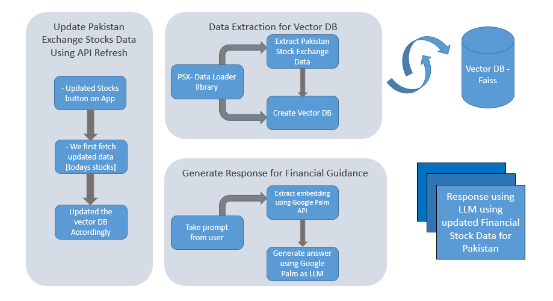

# Project Name: PAISA-BARHAO

## Project Deployment
1. Project is deployed at the following URL `https://paisabarhao.netlify.app/`.
2. Google Cloud Run is used for the Backend and Netlify for Frontend deployment.

## Project Architecture

## Description
PAISA-BARHAO will provide accessible insights into various investment options tailored to the Pakistani market, including stocks, commodities, and mutual funds. Through the app, users can gain valuable information and comparisons to make informed investment decisions, promoting financial literacy and inclusion.

## Technologies Used
- Python
- Flask
- FAISS
- LangChain 
- Docker
- Google Cloud Run 
- Netlify

## Installation
1. Clone this repository to your local machine.
2. Navigate to the project directory.
3. Install `ReactJS`
4. Install the library `npm axios`
5. Install the required dependencies using `pip install -r requirements.txt`.
6. Set up your database configurations in `config.py`.
7. Run the application using `python main.py`.

## Usage
1. Build Image using `docker build -t flask_app .`.
2. Run the server using command `docker run -p 5000:5000 flask_app `
2. Make API requests to endpoints for data processing and model predictions.

## Using Docker
1. Ensure the backend server is running.
2. Make API requests to endpoints for data processing and model predictions.

## Endpoints
- `/api/ask_question`: Endpoint for retrieval of questions answers.
- `/api/create_vector_db`: Endpoint for refresh and update vector DB.

## Contributing
Feel free to contribute to this project by submitting pull requests or reporting issues.
